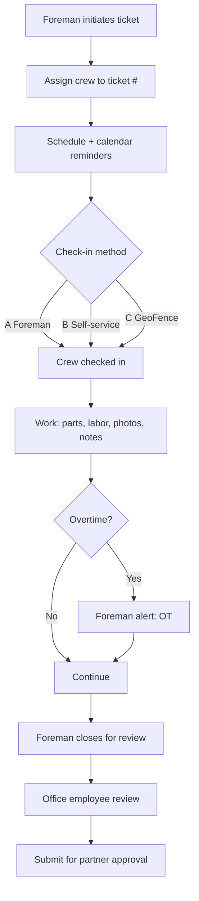

# Foreman Portal — Product Spec (Web + iOS)

**Source:** Handwritten product notes (May 2026)  
**Packages:** `@workspace/vndrly` (web), `@workspace/vndrly-mobile` (iOS / Expo)  
**Status:** Draft — captures intent from notes; not yet scoped to tasks or API contracts

---

## 1. Summary

The **Foreman Portal** is the foreman-facing experience on web and the companion **field-employee iOS app** flow. Together they cover ticket initiation, crew assignment, check-in/out, media capture, scheduling, alerts, and handoff to office staff for partner approval.

**Platform split (high level):**

| Concern | Web (Foreman Portal) | iOS (Field employees + foreman mobile) |
|--------|----------------------|----------------------------------------|
| Primary user | Foreman, office-adjacent vendor staff | Field employees; foreman on-site |
| Ticket lifecycle | Initiate, manage crew, close for review | Check in/out, parts & labor, photos, map |
| Scheduling | Calendar UI, crew → ticket assignment | Schedule view, iCal, reminder toasts |
| Real-time comms | Alerts inbox / links to tickets | Push to talk (proposed), push notifications |
| Storage | Notes & photos via Supabase (public/object ACL) | Same API + Supabase-backed uploads |

---

## 2. Roles & permissions

| Role | Capabilities (from notes) |
|------|-------------------------|
| **Foreman** | First point of contact (P.O.C.) for vendor, visitor, company man with partner when asked. Can **initiate** tickets. Can **close** tickets for office review. Cannot **cancel** tickets (office employee minimum). Receives auto alerts. Can check in crew (Option A). |
| **Field employee** | iOS app: map, site/crew/schedule/ticket context. Self check-in/out (Option B) or geofence (Option C). |
| **Office employee** | Reviews ticket after foreman close; submits for partner approval. Can cancel tickets. |
| **Partner** | Approval after office review (existing lifecycle). |

**Existing code touchpoints (for implementers):**

- Foreman ticket close: `POST /api/tickets/:id/close` (`artifacts/api-server/src/routes/crew.ts`)
- Foreman validation on ticket create: `foremanUserId` guard (Task #507)
- Mobile close-for-review: `artifacts/vndrly-mobile/app/__tests__/ticketDetail.closeForReview.test.tsx`

---

## 3. Structured specification

### 3.1 Point of contact & ticket authority

- Foreman acts as **first point of contact** for vendor-side coordination with visitors, company men, and partners when requested.
- Foreman may **start / initiate** a ticket.
- Foreman **cannot cancel** a ticket; cancellation requires at least **office employee** authority.
- Foreman **closes** a ticket for **office review** before it is submitted for **partner approval**.
- Foreman can **manually enter parts & labor** on the ticket (card).

### 3.2 Media & notes (Supabase)

- Foreman and field staff **take and submit photos**; objects stored in **Supabase** with appropriate public/signed access (consistent with existing storage routes).
- **Notes** saved to Supabase (not local-only storage).

### 3.3 Foreman auto-alerts

Foreman receives **automatic alerts with deep links to the ticket number** when:

1. Newly started ticket from upstream (or % complete milestone — wording in notes ambiguous)
2. Crew signed in / signed out
3. Ticket **re-opened**
4. Job has entered **overtime**

Delivery channel TBD (push, in-app, email/SMS); web inbox + mobile push are both in scope.

### 3.4 “Nudge” (implemented)

**Nudge** reminds the next party up or down the workflow that someone is waiting — it does **not** change ticket status.

| Direction | From | To |
|-----------|------|-----|
| **up** | Field / foreman | Vendor office |
| **up** | Vendor office | Partner |
| **down** | Partner | Vendor office |
| **down** | Vendor office | Field crew |
| **down** | Admin (pivot) | Field crew |
| **up** | Admin (pivot) | Partner |

**API**

- `POST /api/tickets/:id/nudge` — body `{ direction: "up" | "down", message?: string }`
- `GET /api/tickets/:id/nudges` — audit list (newest first)

**Rules**

- Rate limit: one nudge per ticket + actor + direction every **15 minutes** (`429 nudge.rate_limited`, `Retry-After` header)
- Blocked on terminal statuses: `cancelled`, `denied`, `completed`, `funds_dispersed`
- Notifications: `workflow_nudge` (in-app push + SendGrid high-priority email)
- Audit: `ticket_nudges` table

**Error codes:** `nudge.invalid_direction`, `nudge.not_allowed`, `nudge.no_recipients`, `nudge.ticket_closed`, `nudge.rate_limited`

### 3.5 UI / branding

- **Web Foreman Portal UI** should be updated to **match Vendor** branding and layout patterns (partner/vendor colors and logos from Postgres + Supabase assets — not localStorage/cookies).

### 3.6 Communication — push to talk (proposed)

- **Push-to-talk** between **crew and foreman** (voice or PTT-style messaging).
- Mobile-first; web may be listen-only or absent in v1.

### 3.7 Expense & mileage tracking (proposed)

- **Expense tracker** for employees and foremen.
- **Mileage tracker** for crew or foreman.
- Likely ties to ticket/site context and later accounting export; not specified in notes.

### 3.8 Scheduling & calendar

- **Scheduling → Calendar** with reminder **toasts** at:
  - **T−2 days**
  - **T−1 day**
  - **T−1 hour**
- **iOS:** option to **include or merge into iCal** on iPhone.

### 3.9 Crew assignment

- **Setting crews** → **assign crews to a ticket #**.
- Field employees on iOS see crew assignment in app context.

### 3.10 Field employee iOS — core surfaces

Field employees using the iOS app have access to:

- Map
- Site assignment
- Crew assignment
- Schedule
- Ticket #

### 3.11 Check-in / check-out — three options

| Option | Mechanism | Owner |
|--------|-----------|--------|
| **A** | Foreman checks in **crew members** | Foreman (web or mobile) |
| **B** | Field employees **check themselves in & out** | Field employee (iOS) |
| **C** | **GeoFencing** checks them in/out automatically | System (iOS + server) |

**Edge case (Option C):** breaks down if the field employee breaks/loses their iPhone or left it at home — need manual override (Option A or B) and audit trail.

**Existing:** geofence validation on mobile check-in/out; server design allows off-geofence checkout in some paths (see `docs/demo-readiness-2026-04-22.md`).

---

## 4. Web feature list (Foreman Portal)

### 4.1 In scope from notes

| # | Feature | Priority | Notes |
|---|---------|----------|-------|
| W1 | Vendor-matched UI refresh | P0 | Align foreman views with vendor portal branding/components |
| W2 | Initiate ticket | P0 | Foreman as P.O.C.; no cancel |
| W3 | Assign crew to ticket | P0 | Crew picker → ticket # |
| W4 | Scheduling / calendar | P1 | T−2 / T−1 day / T−1 hour reminders (web toasts or notification center) |
| W5 | Close ticket for office review | P0 | Before partner approval |
| W6 | Manual parts & labor entry | P0 | Parts & labor card on ticket |
| W7 | Photo upload (Supabase) | P0 | Same storage model as rest of platform |
| W8 | Notes (Supabase-backed) | P0 | Persisted server-side |
| W9 | Foreman alert inbox | P1 | Linked to ticket #; events in §3.3 |
| W10 | Check-in crew (Option A) | P1 | Foreman-driven crew session |
| W11 | Nudge | P2 | Workflow reminder one step up/down |
| W12 | Expense tracker | P2 | Foreman + employee |
| W13 | Mileage tracker | P2 | Foreman or crew |

### 4.2 Explicitly out of scope for web (from notes)

| Feature | Rationale |
|---------|-----------|
| Push to talk | Proposed as crew ↔ foreman; mobile-first |
| iCal merge | iPhone-specific |
| GeoFencing auto check-in | Device GPS / background location on iOS |

### 4.3 Web — suggested screens / areas

- Foreman dashboard (open tickets, alerts, today’s schedule)
- Ticket detail (crew, parts/labor, photos, notes, close for review)
- Crew management (define crews, assign to ticket)
- Calendar / schedule
- Alert center (deep links to tickets)

---

## 5. iOS feature list (Field app + foreman mobile)

### 5.1 In scope from notes

| # | Feature | Priority | Notes |
|---|---------|----------|-------|
| M1 | Map | P0 | Site / crew context |
| M2 | Site assignment view | P0 | |
| M3 | Crew assignment view | P0 | |
| M4 | Schedule view | P0 | |
| M5 | Ticket # / ticket detail | P0 | Existing ticket flows extend |
| M6 | Self check-in / check-out (Option B) | P0 | |
| M7 | GeoFence auto check-in/out (Option C) | P1 | Fallback when device unavailable |
| M8 | Calendar reminders (T−2, T−1, T−1h) | P1 | Local notifications |
| M9 | iCal include/merge | P2 | Export scheduled jobs |
| M10 | Photo capture & upload (Supabase) | P0 | |
| M11 | Push notifications for foreman alerts | P1 | Upstream ticket, crew in/out, reopen, OT |
| M12 | Push to talk (crew ↔ foreman) | P2 | New capability |
| M13 | Expense tracker | P2 | |
| M14 | Mileage tracker | P2 | |

### 5.2 Foreman-specific on iOS

| # | Feature | Priority |
|---|---------|----------|
| MF1 | Foreman check-in crew (Option A) | P1 |
| MF2 | Receive foreman alerts (same events as §3.3) | P1 |
| MF3 | Close ticket for review (if foreman uses mobile on site) | P0 | Partially exists — verify parity with web |

### 5.3 iOS — edge cases & requirements

- **Geofence failure modes:** lost phone, broken phone, phone left at home → require foreman manual check-in (Option A) and visible “last known” state.
- **Background location:** Option C needs consent, battery, and App Store disclosure (`location-consent` flow exists in mobile app).
- **Offline:** notes/photos queue until connectivity (not in notes; engineering recommendation).

---

## 6. Shared platform requirements

| Requirement | Detail |
|-------------|--------|
| **Supabase storage** | Photos and notes persisted with platform storage ACLs |
| **Branding** | Vendor/partner logos and colors from Postgres; login and in-app brand from API |
| **Ticket deep links** | Alerts and notifications open ticket detail by ID |
| **Audit trail** | Check-in method (A/B/C), nudges, close-for-review, manual parts/labor |
| **i18n** | EN / ES parity on web and mobile (existing standard) |

---

## 7. Ticket lifecycle (from notes)

**Cancel path:** office employee only (not foreman).

---

## 8. Open questions

1. **Alert #1 wording:** “% complete newly started ticket from upstream” — milestone % vs new ticket from partner/vendor queue?
2. **Nudge semantics:** Which roles can nudge whom? Does it create an audit event only or also send push?
3. **Push to talk:** Voice (WebRTC) vs voice notes vs walkie channel — v1 scope?
4. **Expense / mileage:** Per-ticket vs per-pay-period; integration with QuickBooks / 1099 flows?
5. **Option C default:** Is geofence primary with manual override, or optional per vendor?
6. **Web foreman vs mobile foreman:** Full parity or web = back-office, mobile = field?

---

## 9. Suggested phasing

| Phase | Web | iOS |
|-------|-----|-----|
| **Phase 1 — Core field ops** | UI match vendor; initiate ticket; crew assign; parts/labor; photos/notes; close for review | Map, site/crew/schedule/ticket; self check-in/out; photos |
| **Phase 2 — Awareness** | Alert inbox; scheduling calendar + reminders | Push alerts; T−2/T−1/T−1h; foreman crew check-in |
| **Phase 3 — Automation & comms** | Nudge | GeoFence Option C + fallbacks; iCal; push to talk |
| **Phase 4 — Admin** | Expense / mileage | Expense / mileage |

---

## 10. Appendix — raw note transcription

See original handwritten notes (May 2026). Key bullets preserved verbatim intent:

- First P.O.C. for vendor, visitor, company man with partner if asked
- Initiate ticket, not cancel (office employee)
- Photos via Supabase; notes on Supabase
- Auto alerts with ticket links: upstream start, crew in/out, reopen, overtime
- “Nudge” one step up/down for waiting parties
- UI update to match Vendor
- Push to talk crew ↔ foreman
- Expense + mileage trackers
- Scheduling → calendar → toasts T−2, T−1, T−1h; iCal on iPhone
- Setting crews → assign to ticket #
- iOS: map, site, crew, schedule, ticket #
- Check-in A/B/C with geofence edge cases
- Close for office review before partner approval; manual parts & labor card
