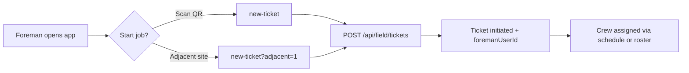
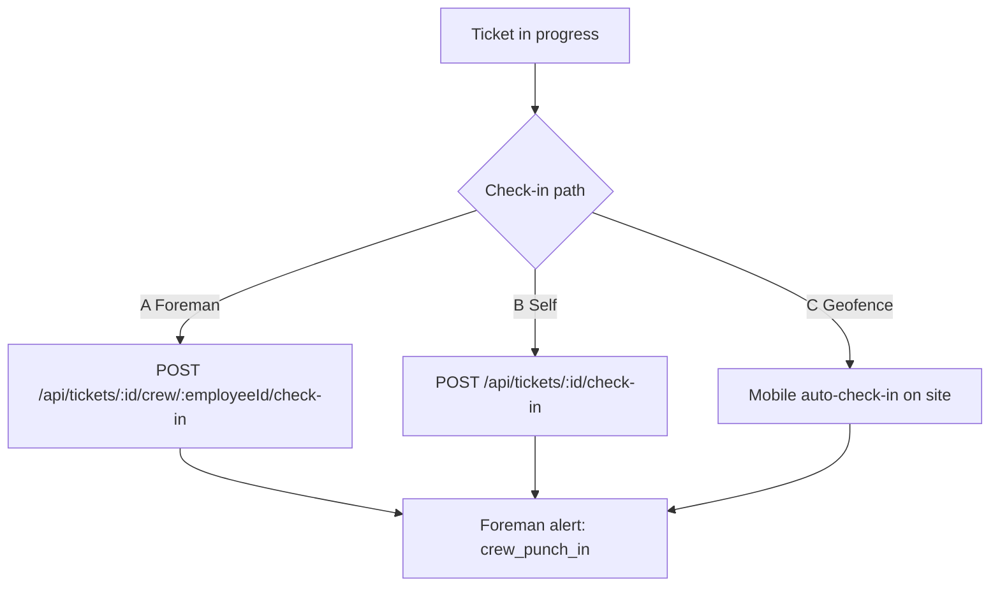
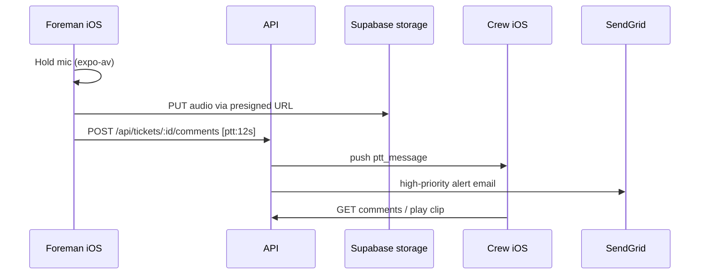
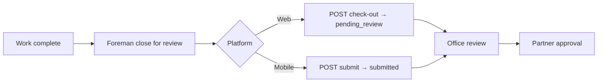
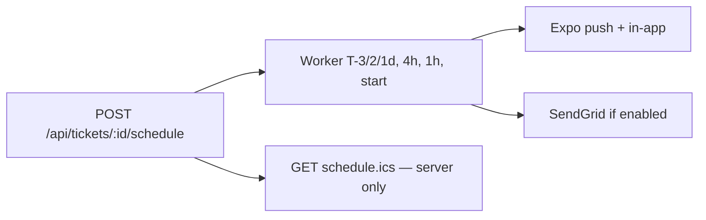

# Foreman Portal — Workflows, Gaps & iOS Update

**Related:** [`foreman-portal-spec.md`](./foreman-portal-spec.md)  
**Updated:** May 2026 — after foreman-focused iOS pass

---

## 1. Role model (who does what)

| Role | Web | iOS | Notes |
|------|-----|-----|-------|
| **Foreman** | `FieldOpsPortalShell` / `foreman-home.tsx` | Tab title “Foreman Portal”; Schedule + **Comms** tabs | `vendorRole`: `foreman` or `both` on `field_employee` session |
| **Field employee** | Shared field schedule | Home, Scan, Profile (no Schedule/Comms) | Self check-in/out, geofence |
| **Office employee** | Vendor portal | — | Review after foreman close; can cancel |
| **Partner** | Partner portal | — | Final approval |

---

## 2. Core workflows (target state)

### 2.1 Start work (foreman as P.O.C.)

**Today:** Implemented on iOS (`new-ticket.tsx`, foreman quick action). Foreman cannot cancel (by design).

### 2.2 Crew check-in (Options A / B / C)

**Gap closed (this pass):** Foreman now gets push + SendGrid email on crew punch in/out when assigned as `foremanUserId`.

**Still open:** Explicit audit enum for A/B/C; geofence auto check-out; lost-phone fallback UX.

### 2.3 Crew communication (push-to-talk)

**Today:** **Comms** tab + hold-to-talk UI; audio in Supabase; `ptt_message` notifications with email lane.

### 2.4 Close for office review

**Still open:** Unify web vs mobile close semantics (`pending_review` vs `submitted` vs `/close` labor freeze).

### 2.5 Scheduling & reminders

**Gap:** iCal merge on iPhone not wired in mobile UI.

---

## 3. Gap matrix (notes vs code)

| Feature | Status | Notes |
|---------|--------|-------|
| Foreman portal shell (iOS) | **Improved** | Quick actions, Active jobs, crew name on rows |
| Initiate ticket | Done | `/api/field/tickets` |
| Crew check-in A | Done | `crew-time-section`, crew API |
| Crew check-in B/C | Partial | Self + geofence; no full auto checkout |
| Foreman ticket detail access | **Fixed** | `field-ticket-access.ts` + `ensureFieldOwnership` |
| Comments/PTT for foreman on crew tickets | **Fixed** | Expanded `ticketParticipantUserIds` |
| Push-to-talk | **New (MVP)** | Comms tab, Supabase audio, `[ptt:]` comments |
| SendGrid for field alerts | **Extended** | `ptt_message` high-priority; crew punch emails |
| Foreman alerts: crew in/out | **New** | `crew_punch_in` / `crew_punch_out` |
| Foreman alerts: OT / reopen / upstream | Open | Not in this pass |
| Workflow “Nudge” | **Done** | `POST/GET /api/tickets/:id/nudge(s)` — 15m rate limit, audit table |
| Expense / mileage module | Open | Ticket odometer only |
| Web UI match vendor branding | Partial | Foreman uses field-ops amber shell |
| iCal on iPhone | Open | API exists |
| Cancel ticket (foreman blocked) | Partial | UI ok; API still allows vendor role |

---

## 4. iOS app map (after this update)

### Tabs — foreman

| Tab | Screen | Purpose |
|-----|--------|---------|
| **Home** | `index.tsx` | Brand row, quick actions, active jobs list |
| **Schedule** | `schedule.tsx` | 14-day jobs, crew ack, crew tracker entry |
| **Comms** | `comms.tsx` | **New** — ticket channel picker + PTT |
| **Scan** | `scan.tsx` | QR → new ticket |
| **Profile** | `profile.tsx` | Settings, org switch |

### Tabs — pure field employee (unchanged)

Home · Scan · Profile

### New / updated files

| File | Role |
|------|------|
| `components/ForemanQuickActions.tsx` | 2×2 action grid (start, schedule, comms, alerts) |
| `components/PushToTalkPanel.tsx` | Hold-to-talk + recent clips |
| `app/(tabs)/comms.tsx` | Foreman crew comms hub |
| `lib/ptt.ts` | Record, upload, post PTT comment |
| `lib/field-ticket-access.ts` (API) | Foreman + roster ticket access |

### Theme preservation

- Dark palette + `useBrand()` primary/accent
- `LayeredPillButton` / pill stack assets for CTAs
- Inter typography, existing card/border tokens
- Org logo in home brand row (unchanged)

---

## 5. What to test on device

1. Log in as foreman (`vendorRole: foreman`) — see **Comms** tab and quick actions.
2. Open an active ticket → **Comms** → hold mic → release → crew receives push.
3. Foreman checks crew in on ticket detail → foreman gets `crew_punch_in` (if different user).
4. Foreman opens ticket where they are `foremanUserId` but not primary field employee — detail loads (no 403).
5. Run `pnpm install` in repo root (adds `expo-av`); rebuild dev client if not using Expo Go.

---

## 6. Recommended next slices

1. **Lifecycle unification** — one “close for review” path across web/mobile.
2. **Foreman alert fan-out** — OT threshold, ticket reopen, upstream start.
3. **iCal** — “Add to Calendar” on schedule rows using `schedule.ics`.
4. **Web foreman parity** — Comms/PTT panel + Nudge button on `ticket-detail.tsx`.
